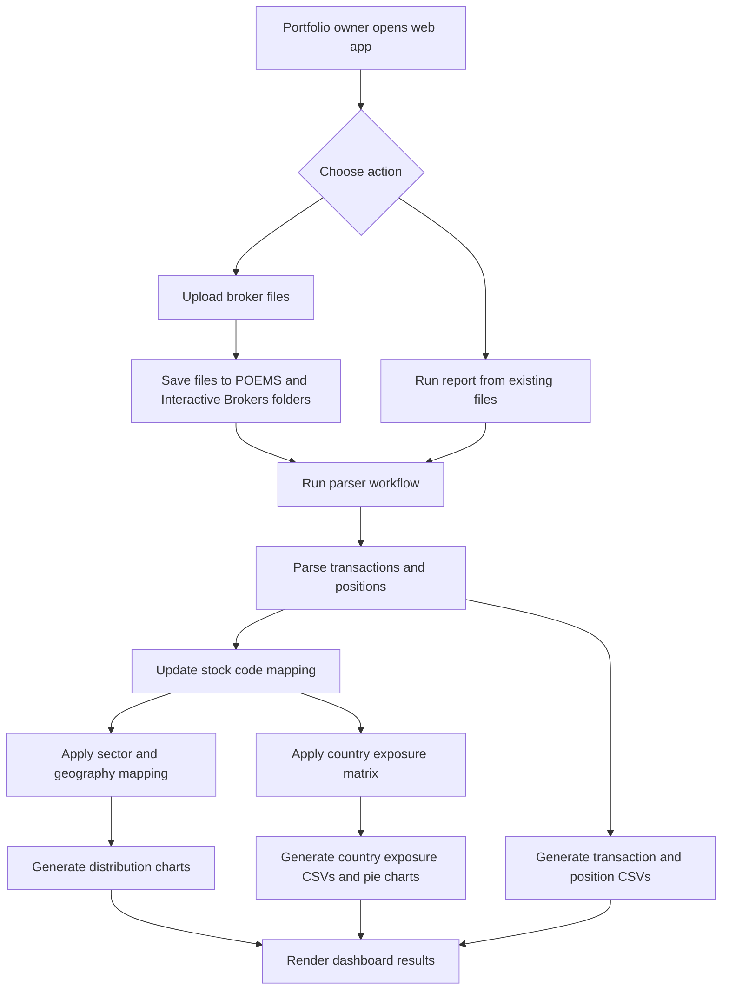
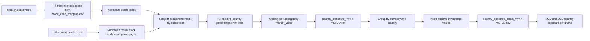
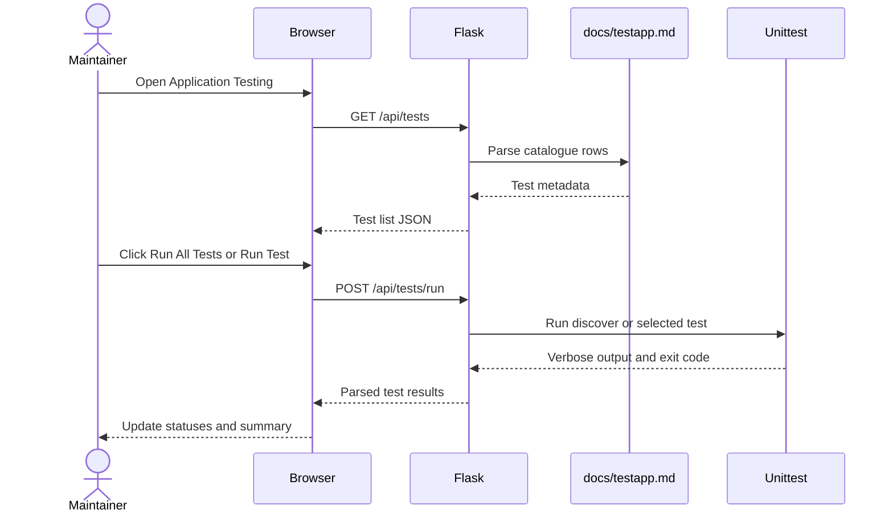

# User Stories

This document retrospectively captures the main user stories for the Portfolio
Tracker project. It describes the intended user outcomes behind the current web
app, parser workflow, generated outputs, charting, country exposure handling,
and application testing features.

## Personas

- Portfolio owner: wants to review current holdings, transactions, charts, and
  country exposure from broker exports without manually combining spreadsheets.
- Portfolio maintainer: updates mapping files when broker names, stock codes,
  sectors, geographies, or country exposure assumptions change.
- Application maintainer: verifies parser, chart, CSV, Flask, and testing-page
  behavior after code or data changes.

## Portfolio Tracking Stories

### US-001 Upload Broker Files

As a portfolio owner, I want to upload POEMS workbooks and Interactive Brokers
CSV files through the web app so that I do not need to manually copy files into
the broker folders.

Acceptance criteria:

- POEMS uploads accept `.xlsx`, `.xlsm`, and `.xls`.
- Interactive Brokers uploads accept `.csv`.
- Unsupported files are rejected with a visible message.
- A successful upload saves files into the configured broker folders and runs
  the report.

### US-002 Run Report From Existing Files

As a portfolio owner, I want to run a report from files already in the broker
folders so that I can refresh the dashboard after changing inputs or mappings.

Acceptance criteria:

- The web app runs the shared parser workflow without requiring new uploads.
- The dashboard shows loaded broker filenames and record counts.
- The web app shows user-friendly errors if report generation fails.

### US-003 Review Transaction And Position Tables

As a portfolio owner, I want transaction and position tables in the browser so
that I can inspect parsed broker data before using the generated files.

Acceptance criteria:

- Transaction rows are shown in a scrollable table.
- Investment positions are shown in a scrollable table.
- Numeric values are formatted for readability in the browser.
- Generated CSV files retain their source numeric precision.

### US-004 Download Generated CSV Files

As a portfolio owner, I want downloadable output CSV files so that I can inspect,
archive, or reuse the parsed data outside the web app.

Acceptance criteria:

- The web app links to dated transaction and position CSV files.
- The web app links to dated country exposure detail and totals CSV files.
- The web app links to `stock_code_mapping.csv`.
- Generated files are written to the sibling `Output` folder, except
  `stock_code_mapping.csv`, which is stored in `data`.

### US-005 Review Portfolio Charts

As a portfolio owner, I want static and interactive charts so that I can quickly
understand portfolio movement and allocation.

Acceptance criteria:

- Seaborn PNG charts are generated for monthly positions, monthly transactions,
  sector distribution, and geography distribution.
- Plotly HTML charts are generated for interactive monthly and distribution
  views.
- The web app can toggle between Seaborn and Plotly chart sets without rerunning
  the report.
- Chart legends and labels are readable in the web app.

## Country Exposure Stories

### US-006 Calculate Country Exposure From Matrix

As a portfolio owner, I want holdings to map to country exposure values so that
I can see economic exposure by country instead of only broker-listed positions.

Acceptance criteria:

- `data/etf_country_matrix.csv` controls country exposure assumptions.
- The required matrix identifier columns are `ETF Name` and `Stock Code`.
- All remaining matrix columns are treated as country percentage columns.
- Country percentages are multiplied by each position's `market_value`.
- Country exposure detail is written to `country_exposure_YYYY-MM-DD.csv`.
- Currency and country totals are written to
  `country_exposure_totals_YYYY-MM-DD.csv`.

### US-007 Support Individual Listed Holdings In Country Exposure

As a portfolio maintainer, I want individual listed holdings such as REITs to
contribute to country exposure so that the country pie chart reflects the full
portfolio.

Acceptance criteria:

- Individual holdings can be added to `data/etf_country_matrix.csv`.
- A Singapore-listed holding can be entered as `100.0` under `Singapore`.
- A holding without a matrix row remains in the detail CSV with zero country
  exposure.
- Only positive country exposure totals contribute to country totals and pie
  charts.

### US-008 Maintain ETF Country Assumptions

As a portfolio maintainer, I want to update ETF country percentages so that
country exposure stays aligned with the ETF's underlying holdings.

Acceptance criteria:

- Global ETFs can have multiple country percentage columns.
- Single-country ETFs can be entered as `100.0` for the relevant country.
- Matrix stock codes are normalized for matching.
- Blank country percentages are treated as zero.

### US-009 Recover Missing Stock Codes

As a portfolio maintainer, I want the app to recover missing stock codes from
known stock names so that country exposure matching still works when broker
exports omit a code.

Acceptance criteria:

- `data/stock_code_mapping.csv` is generated from broker transaction and
  position data.
- The mapping keeps the latest stock name for each stock code.
- Historical stock names are retained in `old_stock_names`.
- Country exposure generation uses current and old stock names to fill blank
  stock codes where possible.

## Maintenance Stories

### US-010 Delete Broker Files

As a portfolio owner, I want to delete uploaded broker files from the web app so
that I can reset the source folders before loading a new dataset.

Acceptance criteria:

- The action asks for confirmation.
- Files are removed from the sibling `POEMS` and `Interactive Brokers` folders.
- The folders themselves remain available for future uploads.
- The current browser display is not unexpectedly cleared.

### US-011 Delete Output Files

As a portfolio owner, I want to delete generated output files so that I can clear
old report artifacts.

Acceptance criteria:

- The action asks for confirmation.
- Files are removed from the sibling `Output` folder.
- The `Output` folder remains available for future reports.
- Existing displayed tables and charts remain visible until rerun or cleared.

### US-012 Clear Browser Display

As a portfolio owner, I want to clear the current browser display so that I can
reset the dashboard view without deleting local files.

Acceptance criteria:

- The action asks for confirmation.
- Counts, file lists, CSV links, charts, tables, captions, and console output
  are cleared.
- Source files and generated output files are not deleted.

## Application Testing Stories

### US-013 View Test Catalogue

As an application maintainer, I want a browser page listing catalogued tests so
that I can understand what behavior is covered.

Acceptance criteria:

- The Application Testing page loads test cases from `docs/testapp.md`.
- Each row displays the test ID, test function name, description, expected
  output, result status, and a run button.
- The page shows a total pass summary.

### US-014 Run All Tests From Browser

As an application maintainer, I want to run the full automated test suite from
the web app so that I can verify the application without switching to the
terminal.

Acceptance criteria:

- `Run All Tests` invokes the unittest discovery workflow.
- The page updates each test row as running, passed, or failed.
- The summary reflects the number of passed tests out of all catalogued tests.
- Long-running tests have a timeout to avoid hanging the web request forever.

### US-015 Run One Test From Browser

As an application maintainer, I want to run one test case from the browser so
that I can quickly verify a focused behavior after a targeted change.

Acceptance criteria:

- Each test row has a `Run Test` button.
- The web app resolves the short test function name to its full unittest ID.
- Unknown test names return a clear error.
- The selected row updates with the result.

### US-016 Keep Documentation Synchronized

As an application maintainer, I want project documentation to stay synchronized
with behavior so that future changes remain understandable and testable.

Acceptance criteria:

- `README.md` reflects setup, running, output, and user workflow changes.
- `docs/WEBAPP_USER_GUIDE.md` reflects web app and testing workflow changes.
- `docs/USER_STORIES.md` reflects user goals, acceptance criteria, diagrams,
  and traceability changes.
- `docs/testapp.md` is updated when tests are added, removed, renamed, or
  materially changed.
- `docs/PYTHON_FILES.md` reflects Python module structure changes.
- `CLAUDE.md` reflects guidance future coding agents should follow.

## Report Workflow Diagram

## Country Exposure Flow Diagram

## Application Testing Flow Diagram

## Traceability Matrix

| Story | Primary files |
|---|---|
| US-001 | `portfolio_tracker/web.py`, `portfolio_tracker/static/app.js`, `portfolio_tracker/templates/index.html` |
| US-002 | `portfolio_tracker/report_runner.py`, `portfolio_tracker/web.py` |
| US-003 | `portfolio_tracker/report_runner.py`, `portfolio_tracker/static/app.js` |
| US-004 | `portfolio_tracker/output_helpers.py`, `portfolio_tracker/web.py` |
| US-005 | `portfolio_tracker/chart_helpers.py`, `portfolio_tracker/report_runner.py` |
| US-006 | `portfolio_tracker/etf_country_exposure.py`, `data/etf_country_matrix.csv` |
| US-007 | `data/etf_country_matrix.csv`, `portfolio_tracker/etf_country_exposure.py` |
| US-008 | `data/etf_country_matrix.csv`, `portfolio_tracker/etf_country_exposure.py` |
| US-009 | `portfolio_tracker/stock_code_mapping.py`, `portfolio_tracker/etf_country_exposure.py` |
| US-010 | `portfolio_tracker/web.py`, `portfolio_tracker/static/app.js` |
| US-011 | `portfolio_tracker/web.py`, `portfolio_tracker/static/app.js` |
| US-012 | `portfolio_tracker/static/app.js`, `portfolio_tracker/templates/index.html` |
| US-013 | `portfolio_tracker/web.py`, `portfolio_tracker/static/testing.js`, `docs/testapp.md` |
| US-014 | `portfolio_tracker/web.py`, `portfolio_tracker/static/testing.js`, `tests/test_project.py` |
| US-015 | `portfolio_tracker/web.py`, `portfolio_tracker/static/testing.js`, `tests/test_project.py` |
| US-016 | `README.md`, `docs/WEBAPP_USER_GUIDE.md`, `docs/USER_STORIES.md`, `docs/testapp.md`, `docs/PYTHON_FILES.md`, `CLAUDE.md` |
